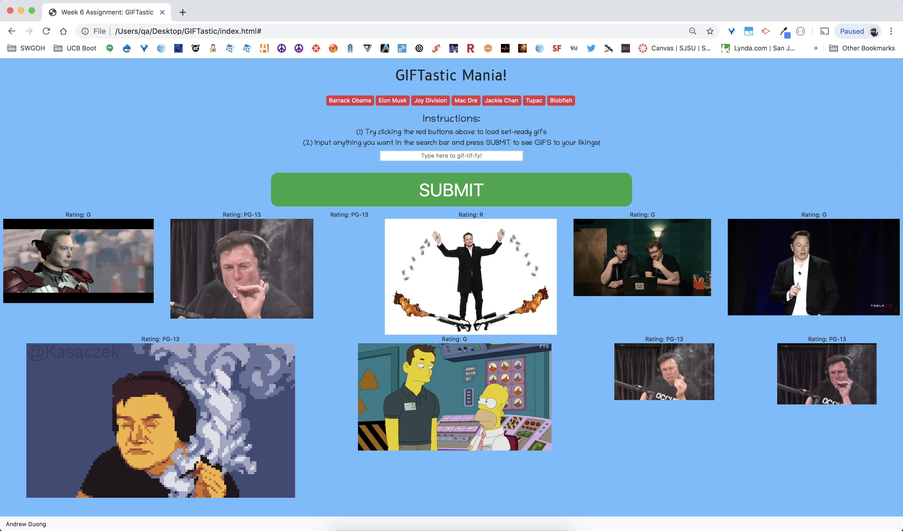

# Title: GIFTastic

## Site Picture:


## Technologies Used:
- HTML: Used to create elements 
- JavaScript: Used in the HTLM files and JS files
- CSS: Used to make to make the styling of the background image and colors & sizes
- Git: Used to document the changes of the source code
- GitHub: Used to create the repository for the html and css in which that can be pushed to GitHub domain

## Summary:
This assignment we learned to used all the javascript  learned throughout the class and where we were able to fully implement out the DOM methods.

## Code Snippet:
```html
<body>

<!-- main div mainContainer that holds the entire trivia game portion areas: question, answers and scoretallyup---->
<body>
    

<!-- created a 'mainContainer' class div to hold everything together  -->
<div id="mainContainer">  
<!-- Main Title Header -->
<br>
    <h1>GIFTastic Mania!</h1>
    <br>
    <!-- This is where the preloaded button choices that are given on the browser -->
    <div id="preloaded-btns"></div>
    <br>
    <!-- The ID 'giftastic-form' was created in as form tag to contain call the main dynamic variables IDs needed to be used on the app.js file-->
    <form id="giftastic-form">
    <!-- header size 4 was created to be the set of instructions for the user -->
            <h3>Instructions:</h3>
            <h5>(1) Try clicking the red buttons above to load set-ready gifs</h5>
            <h5>(2) Input anything you want in the search bar and press SUBMIT to see GIFS to your likings!</h5>
    <!--created the ID 'searchBar-Input' to run as the search bar for what the user would input in dynamically, within the terms of user input being in form of text values, and create new buttons that would render the newly created gif choices  -->
            <input id="searchBar-input" type="text" placeholder="Type here to gif-tif-fy!" style="width: 400px; text-align:center">
            <hr>
            <!-- submit button is created with the help of bootstrap -->
            <input id="user-input" type="submit" value="SUBMIT" class="btn-success" >
        </form>
            <!-- Below the 'giftastic' form area is where the 10 gifs, '#gifs-appear-here' per search click is located and placed-->
        
        <div class = "row">
            <div class='col-xs-12.col-sm-12.col-md-12.col-lg-12'>
            <div id="gifs-appear-here"></div>
            </div>
            </div>
</div>


<script src="assets/javascript/app.js"></script>
<script src="https://ajax.googleapis.com/ajax/libs/jquery/3.2.1/jquery.min.js"></script>
<!-- Link reference to the javascript file: app.js -->
<script type="text/javascript" src="javascript.js"></script>


<nav class="navbar fixed-bottom navbar-light bg-light">
        <a class="footer">Andrew Duong</a>
      </nav>
    
    
    

</body>
  
```


## Author Links:
[GitHub](https://github.com/duongsters)